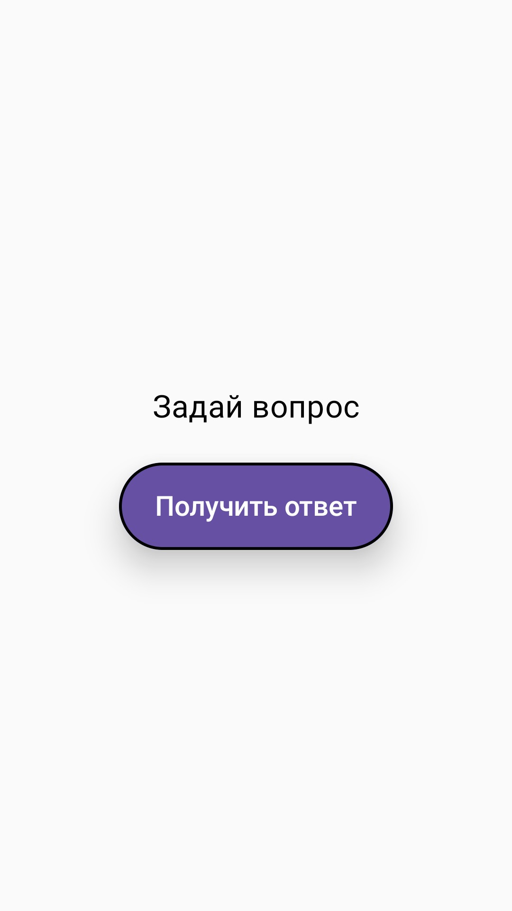
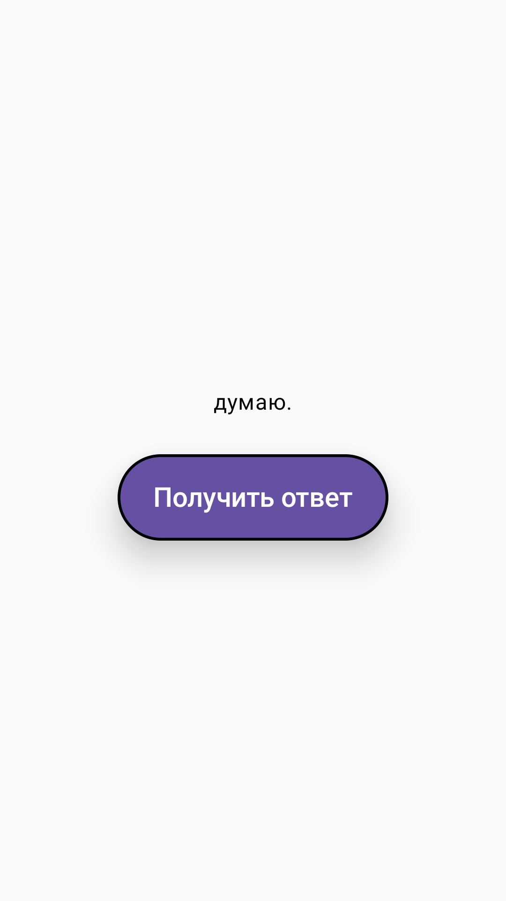
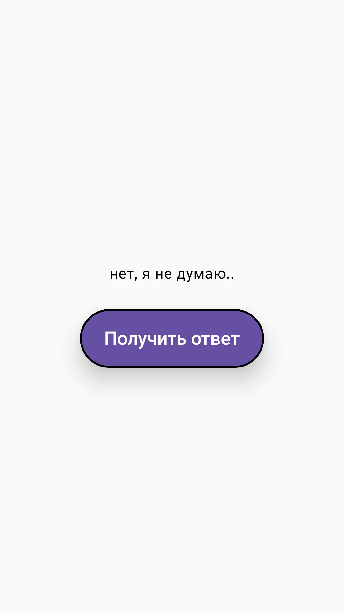
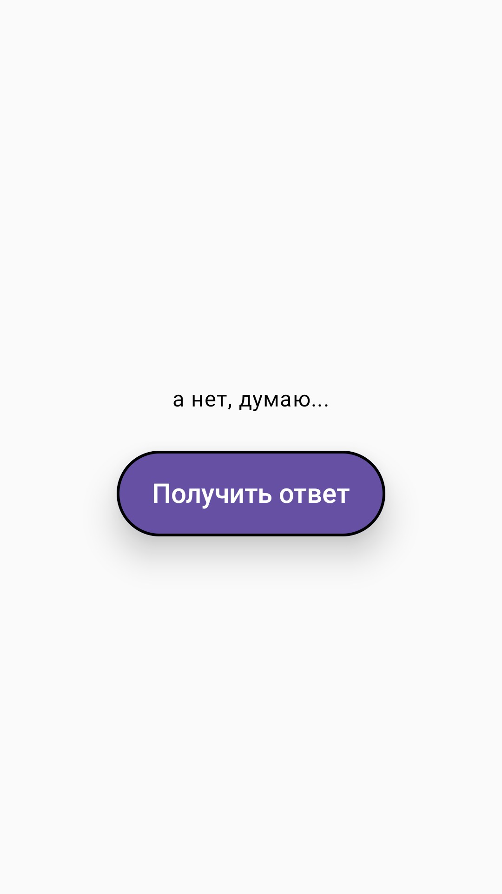
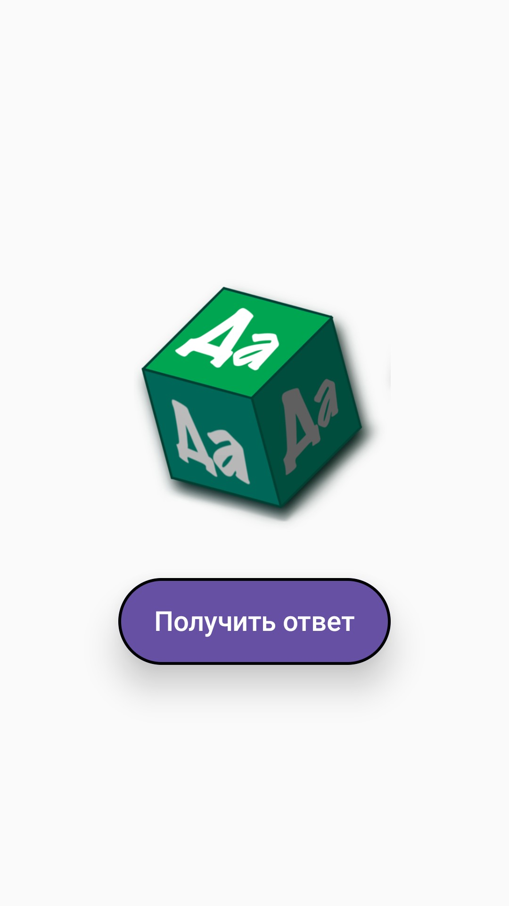
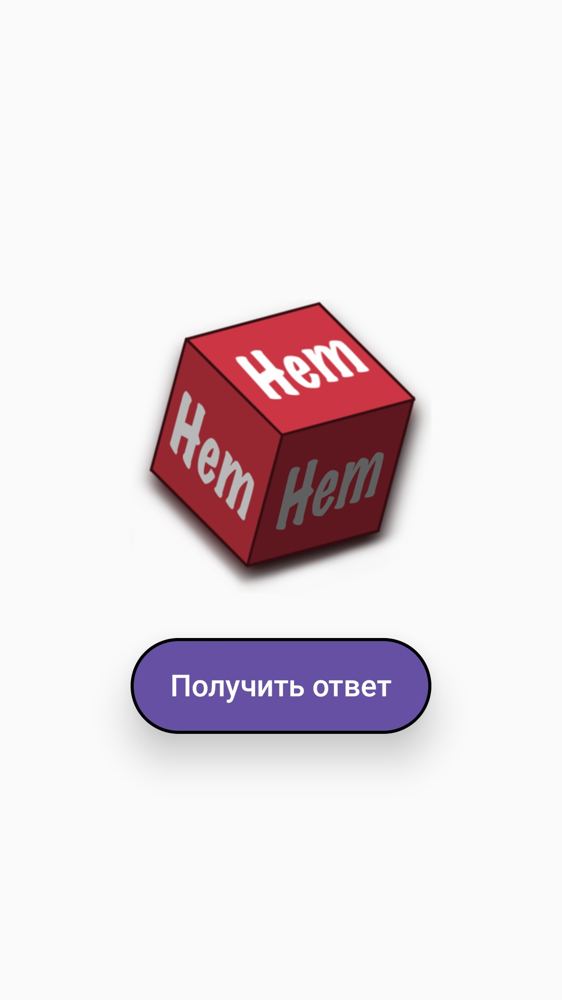

# Yes or No (YesOrNo)

A simple Android app for decision making.

The user asks a question, presses a button and receives a random answer of **«Yes»** or **«No»** with a small wait animation.

---

##  Possibilities

* random response generation;
* minimalist interface on Jetpack Compose;
* displaying images instead of text;
* wait animation before answer;
* animated button with click effect;
* support for modern versions of Android;
* does not require internet connection.

---

## 🛠️ Technologies used

* Kotlin
* Jetpack Compose
* Material 3
* Coroutines
* Android SDK

---

## 📸 Screenshots

     

---

## 🚀 Assembling the project

1. Clone the repository:

```bash
git clone https://github.com/Tat-T/YesOrNo.git
```

2. Open the project in Android Studio.

3. Wait for Gradle dependencies to download.

4. ЗRun the application on an emulator or physical device.

---

## 📦 Requirements

* Android Studio Meerkat или новее
* JDK 11+
* Android SDK 26+

---

## 📄 License

The project is distributed for informational and educational purposes.

---

## Author

Tatyana Yantkova

Junior Software Engineer (.NET)

GitHub: https://github.com/Tat-T
